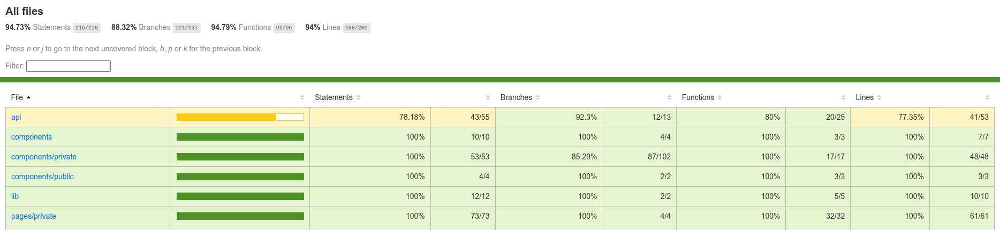

# Pruebas del proyecto — BlogApp (React)

Módulo 3 · Calidad de Software · Ruilova Rahí

El proyecto ya traía una buena base de pruebas unitarias con Vitest (61 pruebas sobre la api, los
helpers, el store, los componentes y las páginas). Lo que faltaba era la parte de extremo a extremo, así
que agregamos Cypress con tres recorridos completos de usuario. Cuidamos que los E2E no repitieran lo que
ya cubren las unitarias: Vitest prueba la lógica aislada y Cypress prueba la app funcionando de verdad.

## 1. Flujos que elegimos para Cypress

**1. Inicio de sesión.** Es la puerta de entrada de la app: sin sesión no se puede administrar nada.
Probamos que un login correcto deje pasar y salga de la pantalla de login, y que uno con datos malos
muestre el aviso de error y no avance.

**2. Alta de una categoría.** Es la operación de administración más representativa (crear un registro).
Probamos que al llenar el formulario la categoría se cree y aparezca en la lista, y que un nombre
demasiado corto muestre el mensaje de validación.

**3. Control de acceso a rutas privadas.** En un panel de administración es crítico que solo entren los
usuarios con sesión. Probamos que sin sesión te redirija al login, y que con sesión sí entres al panel.

Los tests corren sobre la app real levantada en `localhost:5173`. Las llamadas al backend las respondemos
con `cy.intercept` para que las pruebas sean estables y no dependan del servidor. Los 6 tests pasan.

## 2. Cobertura (Vitest)

La suite unitaria queda muy por encima del 70% pedido: **94.7% en statements y 88.3% en branches**. Cada
prueba revisa un caso concreto: que funcione, que falle como debe y los casos raros (nulos, vacíos,
límites).

## 3. Por qué separamos así

- **Vitest (unitario):** las funciones de la api (armar y leer las peticiones, manejar errores), los
  helpers (jwt, urls, color de avatar), el store de autenticación y de avisos, y los formularios y páginas
  probados de forma aislada con MSW.
- **Cypress (E2E):** entrar, moverse entre pantallas, el guardián de rutas y el alta real de un registro
  con su validación, tal como lo vive el usuario.

## 4. Lo que más nos costó

La parte más difícil fue afinar los E2E, no escribirlos. Al principio nuestros interceptores de red eran
demasiado amplios (`**/categories*`) y sin querer atrapaban los módulos que Vite sirve en desarrollo (por
ejemplo `categories.api.ts`), lo que rompía la app y hacía que no aparecieran los campos; lo arreglamos
usando expresiones regulares que solo matchean la ruta real de la API. También tuvimos que manejar dos
detalles del framework: el login lanza una promesa sin capturar cuando el backend responde 401 (lo
ignoramos en Cypress porque el aviso igual se muestra), y el diálogo de Radix anima su opacidad, así que
para el mensaje de validación verificamos que exista en lugar de exigir visibilidad estricta. Nos quedó
claro que gran parte de la calidad de un E2E está en aislar bien lo externo.
